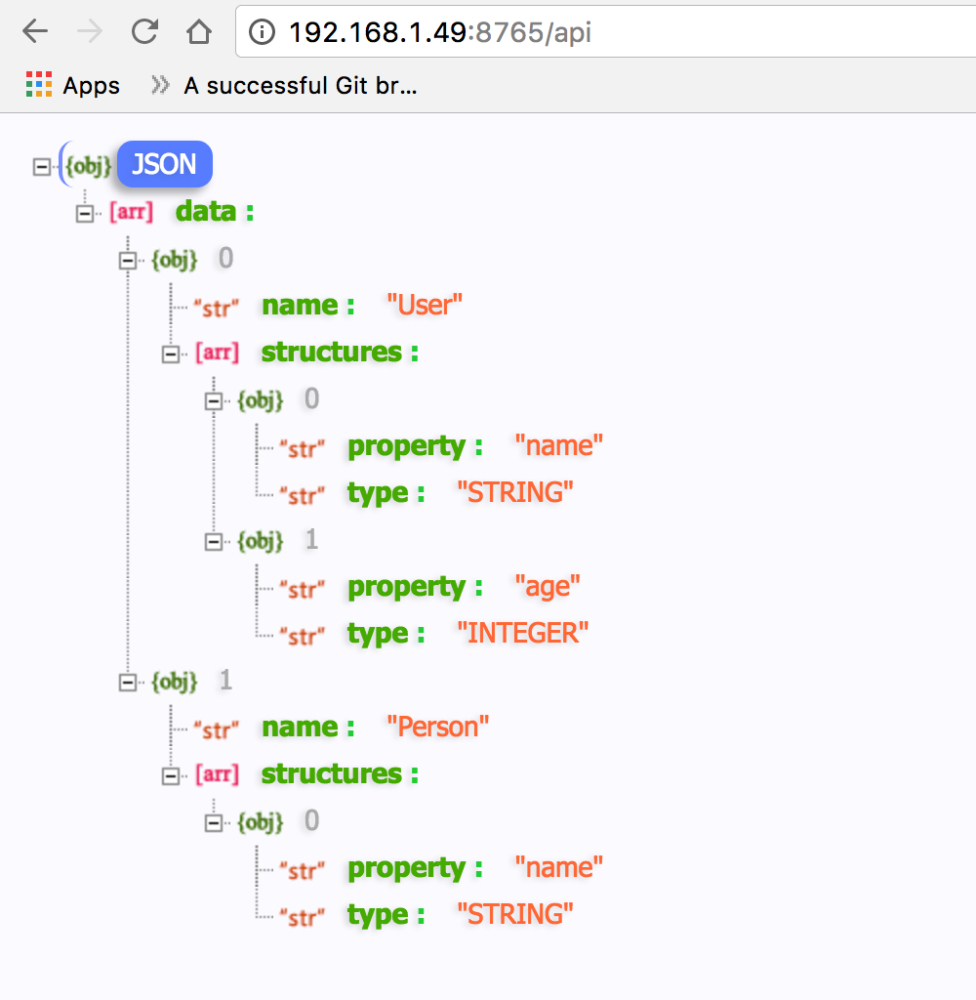
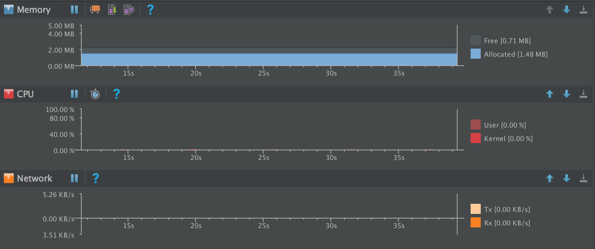

# Installation
https://jitpack.io/#nhancv/nc-android-realm-browser
```
1. Add it in your root build.gradle at the end of repositories:
	allprojects {
		repositories {
			...
			maven { url 'https://jitpack.io' }
		}
	}

2. Add the dependency in app build.gradle

	dependencies {
	        compile 'com.github.nhancv:nc-android-realm-browser:${version}'
	}
```

# Usage
```java
Realm.init(this);
RealmConfiguration config = new RealmConfiguration.Builder()
        .deleteRealmIfMigrationNeeded()
        .schemaVersion(0)
        .build();
Realm.setDefaultConfiguration(config);

NRealmServer.init(new NRealmDiscovery(this, config));
```

Start/stop server
```
    @Override
    protected void onStart() {
        super.onStart();
        NRealmServer.start();
    }

    @Override
    protected void onStop() {
        super.onStop();
        NRealmServer.stop();
    }
```

Get server ip-address
```
String address = NRealmServer.getServerAddress(this);
Log.e(TAG, "Server address: " + address);
```
Api support
```
/api
/api?where=<table_name>
/api?where=<table_name>&all
/api?where=<table_name>&field=<column_name>&equal=<value>
/api?where=<table_name>&field=<column_name>&begin=<value>
/api?where=<table_name>&field=<column_name>&contains=<value>
```
Such as log output:
`Server address: http://192.168.1.49:8765`

Get schema info
`http://192.168.1.49:8765/api`

# Screenshot

<br>

